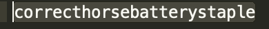

## Teaching Data Science Workshop

### Agenda

Time | Topic |  Exercises and Demos
------------ | -------------  | --------
9 - 10 | Introduction  Computing | [Ex1-GettingStartedWithR](./exercises/Ex1-GettingStartedWithR.Rmd)
  &nbsp;     |   &nbsp;     | Ex1-DataTypesAndVectors
10 - 11 | Simulation and Testing  |  Ex2-BloodPressureExpt
  &nbsp;     |   &nbsp;     | Ex2-RouletteSimulation
11:00-11:30 |	BREAK  | &nbsp;
11:30-12:40 |	Visualization	 | Ex3-Graphics-GGPlotIntro	
 &nbsp;  | &nbsp; | Ex3-BikeShareGraphics
12:40-13:15	 | Bootstrapping	|	Ex4-KleiberBootstrap	
13:15-14:00 | 	LUNCH	 | &nbsp;		
14:00-14:30 |	 &nbsp; |  Ex4-waitTimeBootstrap 
14:30-15:00 |	Data Science Life Cycle	|	donkey weight	case study
15:00-15:30	 | Data Joins	 |	Ex6-ToyBoatReshaping	
15:30-16:00	| BREAK	 |	 &nbsp;
16:00-17:00 |	Q&A		 |	&nbsp;

### Access RStudio Hub

[RStudio Hub](https://workshop.datahub.berkeley.edu/hub/user-redirect/git-pull?repo=https%3A%2F%2Fgithub.com%2Fdebnolan%2FTeachingDataScience&urlpath=%2Frstudio)

Login: email address

Password: 
